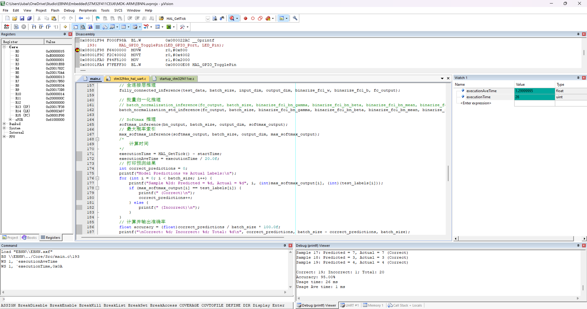

# STM32 Binarized Neural Networks (BNN)

Deploy Binarized Neural Networks (BNNs) AI on any Microcontroller Unit (MCU).

As an example, I deploy model inference on an STM32-STM32F411CEU6 MCU, running at 100 MHz (0.1GHz).

Using the MNIST dataset for digit classification tasks, the network utilizes an MLP architecture with a total of 7,890 parameters. Each inference takes ****only 1.3 ms**.

For training Binarized Neural Networks and automatically generating C code, please refer to the repository: <https://github.com/ittuann/Binarized-Neural-Networks>

